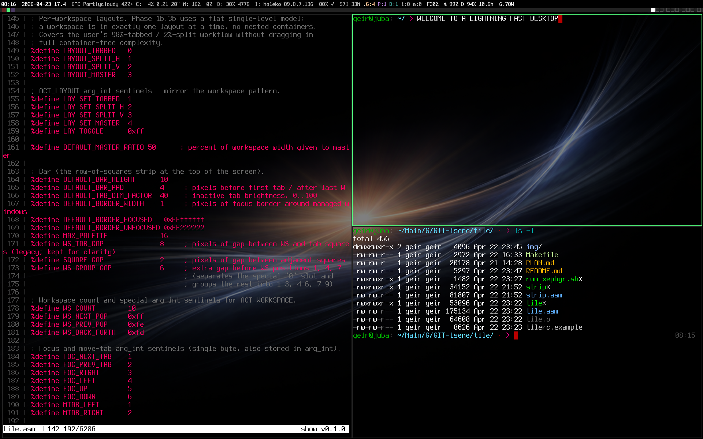

# glass - Pure Assembly Terminal Emulator



       

Terminal emulator written in x86_64 Linux assembly. No libc, no runtime, pure syscalls. Speaks X11 wire protocol directly via Unix socket. Single static binary, 58KB.

No toolkit, no rendering library, no font engine. Just your keystrokes, the X11 server, and the kernel.

Part of the **CHasm** (CHange to ASM) suite: [bare](https://github.com/isene/bare) (shell), [show](https://github.com/isene/show) (file viewer), glass (terminal emulator).

<br clear="left"/>



glass driving every pane in the
[CHasm](https://github.com/isene/chasm) desktop, with
pseudo-transparency picking up the wallpaper. Every binary on
screen is x86_64 assembly — tile holds the layout, strip + asmites
(the per-segment programs in
[chasm-bits](https://github.com/isene/chasm-bits)) drive the status
row, show is rendering syntax-highlighted source in the left and
bottom-right panes, bare is the shell.

## Install

### From source (requires nasm and ld)

```bash
git clone https://github.com/isene/glass.git
cd glass
make
sudo make install
```

`make install` also installs the bundled emoji cache (1170
single-codepoint emoji pre-rendered at 12x13, the default font cell
size) to `/usr/local/share/glass/emoji/`. First-time emoji rendering
is instant; any not in the bundle are rasterized once via ImageMagick
`convert` and written to `~/.cache/glass/emoji/`.

To rebuild the bundled cache for a different cell size (e.g. if you
use a larger font):

```bash
make emoji-cache W=20 H=20   # rebuild for 20x20 cells
sudo make install-emoji
```

The `convert` command (ImageMagick) and the Noto Color Emoji font are
only needed for rendering emoji NOT in the cache; glass itself has no
runtime dependencies beyond an X11 server.

## Configuration

Create `~/.glassrc` for custom colors:

```
bg = #1a1b26
fg = #c0caf5
cursor = #f7768e
font_size = 13
opacity = 80
cursor_blink = 500
bg_cycle = #000000,#001a33,#002200,#200033,#330011,#332200,#003333
opacity_cycle = 100,75,50,25,0
font_weight = bold
```

Available font sizes: 10, 13, 15, 18, 20 (misc-fixed, always present),
22, 24, 28, 32 (xos4-terminus, requires the `xfonts-terminus` package
on Debian/Ubuntu/Arch/Fedora — much more legible at large sizes).
Colors are hex RGB.

`font_weight = bold` aliases the regular font to the bold XLFD, so
all text gets the heavier strokes that TTF terminals use by default.
SGR 1 (bold) then has no further effect since terminus has no
extra-bold beyond bold.
`cursor_blink` is the toggle interval in milliseconds (omit or set
to `0` for a steady cursor).
`opacity` is a 0..100 percentage (100 = opaque, default). Values
below 100 prefer a 32-bit ARGB visual when a compositor (picom,
compton, KWin, Mutter, etc.) is detected via `_NET_WM_CM_S0` — that
gives true per-pixel see-through. With no compositor, glass reads
the desktop wallpaper from `_XROOTPMAP_ID`, samples it strip by
strip behind the window, blends each pixel with the configured
`bg` using `opacity`, uploads the blended bitmap as the window's
background pixmap, and switches the renderer to PolyText16 for
default-bg cells so the wallpaper texture shows through. Without
a configured `opacity`, none of this code runs.

## Features

### Rendering
- X11 wire protocol over Unix domain socket (no Xlib/XCB)
- Xauthority cookie authentication (MIT-MAGIC-COOKIE-1)
- Unicode BMP rendering via ImageText16 with iso10646-1 font
- UTF-8 decoding state machine (2/3/4-byte sequences)
- Per-color-run rendering (each color segment drawn separately)
- 256-color palette with truecolor (24-bit) SGR mapping
- Inverse video (SGR 7) for status bars
- Configurable background, foreground, and cursor colors
- Visual selection rendering (inverted cells during drag)
- Visual bell on BEL (0x07)
- No-flicker rendering (omits ClearArea since cells fully repaint)

### Terminal Emulation
- VT100/xterm escape sequence parser
- Alternate screen buffer (CSI ?1049h/l) for vim, less, man, htop
- Scroll regions (DECSTBM) for vim splits
- DECSET/DECRST modes: cursor visibility, autowrap, mouse tracking, bracketed paste
- Cursor shapes: block, underline, bar (CSI q)
- Insert/delete lines and characters (CSI L/M/@/P/X)
- SGR: bold, underline, inverse, 8/16/256, full 24-bit truecolor (no quantization)
- Charset designators ESC ( / ) / * / + consumed (no stray 'B' from ncurses)
- OSC 0/2: dynamic window title
- CSI private prefixes: ?, >, =
- Reply-aware event parsing (variable-size replies don't misalign event stream)

### Input
- Proper X11 keyboard mapping (GetKeyboardMapping from server)
- AltGr (Mod5) support for international keyboard layouts (e.g., Norwegian AltGr+4 → $)
- Latin-1 keysyms (0x00A0-0x00FF) sent as UTF-8 (e.g., AltGr+3 → £)
- Arrow keys, Home/End, Page Up/Down, Delete, function keys
- Ctrl and Shift modifiers
- Mouse reporting (SGR mode 1006) for vim, tmux
- Bracketed paste mode (CSI ?2004h/l)
- Ctrl+Shift+V pastes CLIPBOARD selection
- Shift+Insert pastes PRIMARY selection (X11 tradition)
- Ctrl+D properly exits glass when bare exits (POLLHUP detection)

### Interaction
- Scrollback buffer (1000 lines, Shift+PageUp/Down)
- Text selection (click and drag, visible inverted highlight)
- Double-click to select word (alnum + `_-./~+@:%=`)
- Triple-click to select whole line
- Selection populates X11 PRIMARY for paste in other apps
- Wrap-aware copy: visually-wrapped lines join into one logical line when selected
- Glass responds to SelectionRequest (TARGETS, UTF8_STRING, STRING)
- URL detection (http/https), Ctrl+click to open with xdg-open
- OSC 8 hyperlinks (`ESC ] 8 ; params ; URI ESC \\`); Ctrl+click opens URI
- PTY resize on window resize with SIGWINCH
- Initial PTY size from screen dimensions (no 80×24 default)
- TERM=xterm-256color set in child environment

### Architecture
- Pure x86_64 Linux syscalls (no libc)
- Single `.asm` source file (~8000 lines)
- Static binary (~58KB, zero dependencies)
- PTY management (posix_openpt, setsid, TIOCSCTTY)
- X11 request batching (single write per frame)
- 8-byte grid cells (UCS-2 char + fg + bg + attrs)
- Circular scrollback buffer
- Drains large QueryFont replies (~786KB for Unicode font) to keep socket aligned

## How It Works

glass connects to the X11 server via a Unix domain socket (`/tmp/.X11-unix/X0`), authenticates with the Xauthority cookie, and speaks raw X11 wire protocol. No Xlib, no XCB, no toolkit.

It opens a PTY, forks a child shell ([bare](https://github.com/isene/bare) by default), and enters an event loop polling both the X11 socket and the PTY master. Keyboard events are translated to terminal input via the server's keymap. PTY output is parsed through a VT100 state machine and rendered to an internal grid. The grid is drawn to the X11 window using batched ImageText16 requests with per-color-run optimization.

Selection works via the X11 PRIMARY mechanism: drag-select to claim ownership, other apps' middle-click or Shift+Insert sends a ConvertSelection request to glass which responds with the selection text via ChangeProperty + SelectionNotify.

## Key Bindings

| Key | Action |
|-----|--------|
| Shift+PageUp | Scroll back |
| Shift+PageDown | Scroll forward |
| Ctrl+Shift+V | Paste from CLIPBOARD |
| Shift+Insert | Paste from PRIMARY (selected text) |
| Ctrl+Click | Open URL under cursor |
| Ctrl+D | Exit (when shell line is empty) |
| Alt+plus / Alt+= | Step font size up to next preset |
| Alt+minus | Step font size down to previous preset |
| Alt+_ / Alt+0 | Reset font size to the configured default |
| Alt+b | Cycle through `bg_cycle` colors from `~/.glassrc` |
| Alt+t | Cycle through `opacity_cycle` percentages, or toggle 100↔50 if no cycle is set (compositor → `_NET_WM_WINDOW_OPACITY`; otherwise wallpaper-blend pseudo-transparency) |

The five Alt-key shortcuts are rebindable via `~/.glassrc`:

```
key.font_inc    = alt+plus
key.font_dec    = alt+minus
key.font_reset  = alt+underscore
key.bg_cycle    = alt+b
key.opacity     = alt+t
```

Modifiers: `alt`, `ctrl`, `shift`. Keys: any single ASCII character or
the named keys `plus`, `minus`, `underscore`, `equal`, `space`. An
empty value disables the binding.

## Roadmap

- [x] True emoji rendering (XRender extension + bundled cache)
- [x] Opacity/transparency (compositor + wallpaper sampling fallback)
- [x] Configurable key bindings (the five Alt-key shortcuts)
- [ ] Pure-asm TTF parser/rasterizer (the bonkers route — kitty-grade fonts without breaking pure-asm/zero-deps)
- [ ] Tab/split support (multiple PTYs)
- [ ] Font ligatures
- [ ] Image display via kitty graphics protocol (APC `ESC _G ... ESC \`) — rasters now silently consumed
- [ ] WM_CLASS for window manager integration

## The CHasm Suite

| Tool | Purpose | Binary | Lines |
|------|---------|--------|-------|
| [bare](https://github.com/isene/bare) | Interactive shell | ~150KB | ~16K |
| [show](https://github.com/isene/show) | File viewer | ~40KB | ~3.4K |
| glass | Terminal emulator | ~75KB | ~8K |

All three: pure x86_64 assembly, no libc, no dependencies, direct syscalls.

## License

[Unlicense](https://unlicense.org/) (public domain)
